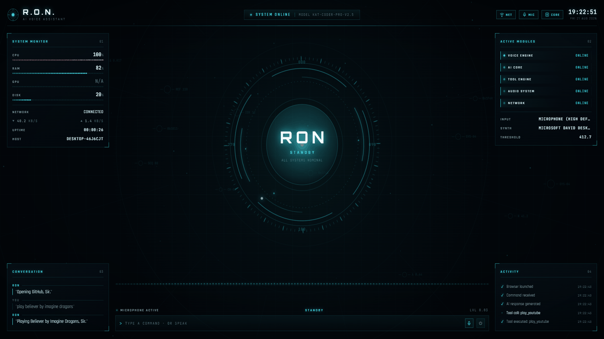
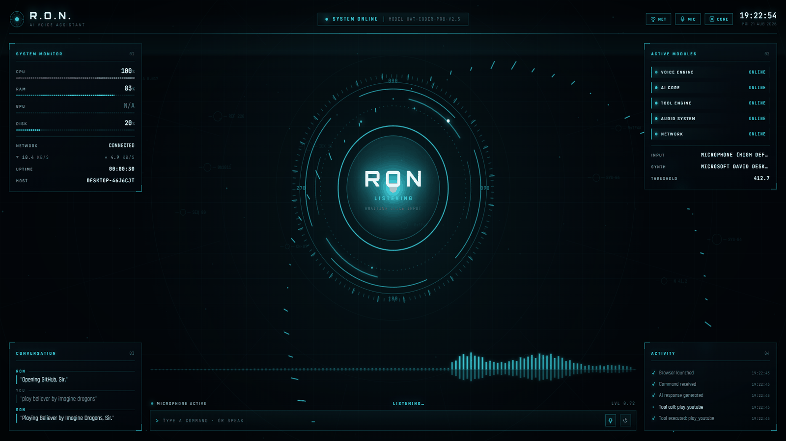
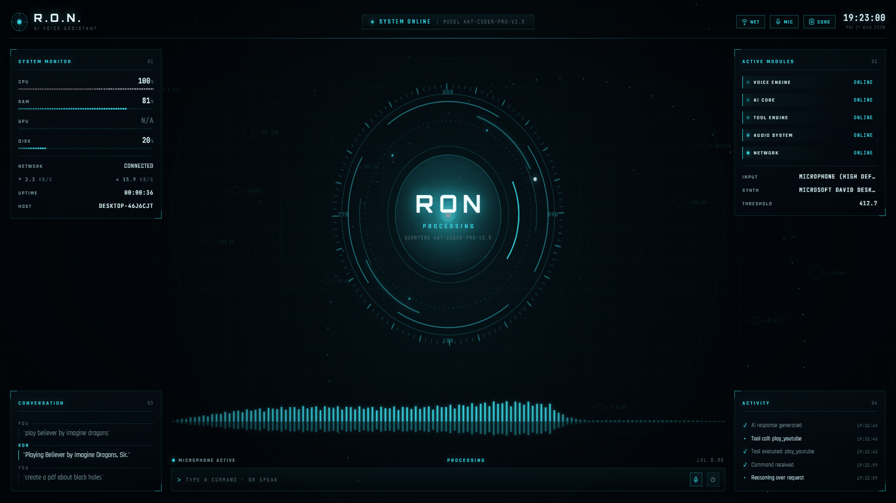
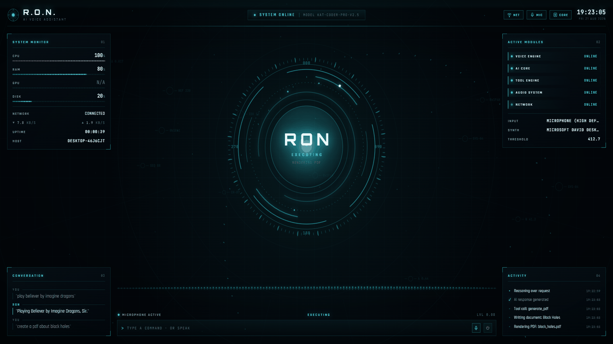
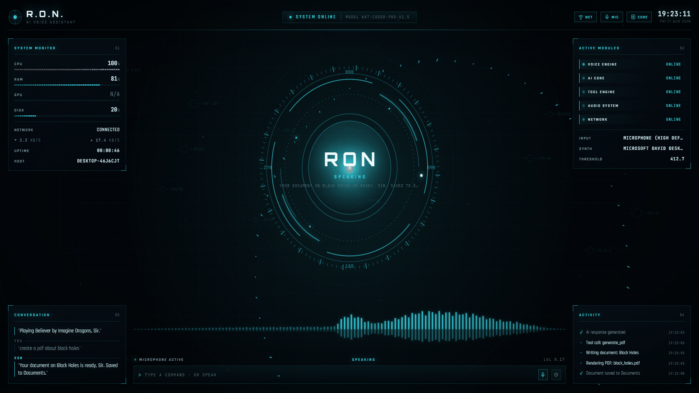
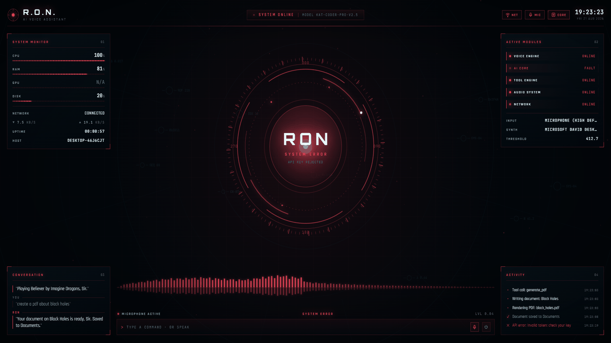

<div align="center">

# 🤖 Ron — Personal AI Voice Assistant

**A JARVIS-inspired voice assistant for Windows that listens, thinks, and acts.**

[](https://www.python.org/)
[](https://www.microsoft.com/windows)
[](LICENSE)
[]()

*Built by [Ifteqhar]([https://github.com/ifteqhar](https://github.com/Eftyqhar)) — Your always-on desktop companion.*

<br>



<sub>*The R.O.N. holographic HUD — live system telemetry, conversation log, and activity feed around a reactive core.*</sub>

</div>

---

## 📖 Overview

**Ron** is a fully voice-controlled, JARVIS-style personal AI assistant that runs on your Windows desktop. Speak naturally — Ron listens, understands your intent, and either responds conversationally **or** executes a tool action (opening apps, visiting websites, playing YouTube videos, generating PDFs) without you touching the keyboard.

It combines real-time speech recognition (Google Speech-to-Text), offline text-to-speech (Windows SAPI), and a function-calling LLM (`kat-coder-pro-v2.5`) routed through an OpenAI-compatible endpoint.

> *"Ron is online. How can I help you, Sir?"*

---

## ✨ Features

| Feature | Description |
|---|---|
| 🎙️ **Voice Input** | Hands-free speech recognition via microphone |
| 🗣️ **Voice Output** | Natural offline TTS using Windows SAPI |
| 🧠 **LLM Brain** | `kat-coder-pro-v2.5` via OpenAI-compatible API |
| 🛠️ **Function Calling** | AI emits JSON tool calls; assistant executes them |
| 🎵 **Play YouTube** | *"Play Believer by Imagine Dragons"* → instant playback |
| 🌐 **Open Websites** | Smart URL resolution via DuckDuckGo + known-site dictionary |
| 📁 **Open Folders/Drives** | *"Open D drive"* or *"Open projects folder"* |
| 🖥️ **Launch Apps** | Notepad, Chrome, VS Code, Spotify, WhatsApp, and more |
| 📄 **Generate PDFs** | *"Create a PDF about black holes"* → a formatted 3–5 page report in Documents |
| 🔁 **Continuous Listening** | Always-on loop with smart shutdown phrases |
| 🧩 **Modular Design** | Cleanly split into `main`, `voice`, and `tools` modules |

---

## 🖥️ The Holographic HUD

Ron ships with a **frameless, fullscreen heads-up display** served locally by
`ui_server.py` and streamed to the browser over Server-Sent Events. The core,
waveform, and entire colour palette react in real time to Ron's internal state —
alongside live CPU/RAM/GPU/disk/network telemetry, module health, a rolling
conversation log, and a timestamped activity feed.

```bash
python ui_server.py          # or double-click run_ron_ui.bat
```

Opens a Chromium app window on `http://127.0.0.1:8765`. Pass `--no-voice` to run
the interface without the microphone loop.

### Interface States

Every state constant in `bus.py` drives its own visual treatment:

|  |  |
|:--:|:--:|
| <br>**`idle` → STANDBY**<br><sub>All systems nominal. Core at rest, waveform flat.</sub> | <br>**`listening` → LISTENING**<br><sub>Rings open up, live mic waveform, particle stream.</sub> |
| <br>**`thinking` → PROCESSING**<br><sub>Querying the model; activity logs *Reasoning over request*.</sub> | <br>**`executing` → EXECUTING**<br><sub>Core locks while a tool call runs — here, rendering a PDF.</sub> |
| <br>**`speaking` → SPEAKING**<br><sub>The spoken reply is mirrored under the core as TTS plays.</sub> | <br>**`error` → SYSTEM ERROR**<br><sub>Palette swaps to red and the faulting module is flagged.</sub> |

> Prefer the terminal? Everything above is optional — `python main.py` runs Ron
> headless exactly as before.

---

## 🏗️ Architecture

```
┌─────────────────────────────────────────────────────────┐
│                    User (Voice)                          │
└────────────────────────┬────────────────────────────────┘
                         ▼
              ┌──────────────────────┐
              │   voice.py (STT)     │  ◄── Microphone
              │   Google Speech API  │
              └──────────┬───────────┘
                         ▼
              ┌──────────────────────┐
              │     main.py          │
              │  Intent Dispatcher   │
              └──┬──────────┬────────┘
                 │          │
        (Direct) │          │ (Conversational)
                 ▼          ▼
   ┌──────────────────┐   ┌──────────────────────┐
   │   tools.py       │   │  LLM (kat-coder via  │
   │ • play_youtube   │   │   hcnsec.cn API)     │
   │ • open_website   │   │  Returns JSON tool   │
   │ • open_app       │   │  call OR text reply  │
   │ • generate_pdf   │   └──────────┬───────────┘
   └────────┬─────────┘              │
            ▼                        ▼
       ┌────────────────────────────────────┐
       │     voice.py (TTS — Windows SAPI)   │ ──► Speaker
       └────────────────────────────────────┘
```

---

## 🚀 Quick Start

### Prerequisites

- **OS:** Windows 10 / 11
- **Python:** 3.8 or higher
- **Microphone:** Any working input device (built-in, USB, or virtual like *WO Mic*)
- **API Key:** An OpenAI-compatible key from [hcnsec.cn](https://hcnsec.cn) (or swap in your own endpoint)

### 1. Clone the Repository

```bash
git clone https://github.com/Eftyqhar/RON.git
cd RON
```

### 2. Install Dependencies

```bash
pip install -r requirements.txt
```

> **Note (Windows):** If `pyaudio` fails to install, grab the precompiled wheel matching your Python version from [PyAudio wheels](https://www.lfd.uci.edu/~gohlke/pythonlibs/#pyaudio), then `pip install <wheel-file>`.

### 3. Configure Your Microphone

Run the mic test and pick the correct device index:

```bash
python test_mic.py
```

Update `MIC_INDEX` in `voice.py` to match the working device.

### 4. Set Your API Key

Open `main.py` and replace the placeholder:

```python
client = OpenAI(
    api_key="YOUR_API_KEY",                 # ← paste your key here
    base_url="https://api.hcnsec.cn/v1"
)
```

### 5. Launch Ron

**Option A — Direct:**
```bash
python main.py
```

**Option B — Batch file:**
Double-click `run_ron.bat`

**Option C — Voice activation on boot:**
Place a shortcut to `run_ron.bat` in `shell:startup`.

**Option D — Text mode (no microphone):**
```bash
python main.py "create a pdf about black holes"
```
Runs a single command through the full pipeline — useful for testing when no
mic is attached.

---

## 🎤 Voice Commands

Ron understands natural language. Here are examples:

### 🌐 Open Websites
| Say This | What Happens |
|---|---|
| *"Visit Facebook"* | Opens facebook.com |
| *"Go to GitHub"* | Opens github.com |
| *"Open reddit"* | DuckDuckGo search → top result |
| *"Take me to ifteqhar.dev"* | Smart URL resolution |

### 🖥️ Launch Apps
| Say This | What Happens |
|---|---|
| *"Open Chrome"* | Launches Chrome |
| *"Open VS Code"* | Launches VS Code |
| *"Open Spotify"* | Launches Spotify (MS Store) |
| *"Open Notepad"* | Launches Notepad |

### 🎵 Media
| Say This | What Happens |
|---|---|
| *"Play Lo-fi beats"* | Plays matching YouTube video |
| *"Play Despacito"* | Plays music on YouTube |

### 📁 Files & Folders
| Say This | What Happens |
|---|---|
| *"Open D drive"* | Opens File Explorer at D:\ |
| *"Open projects folder"* | Opens projects folder |

### 📄 Documents
| Say This | What Happens |
|---|---|
| *"Create a PDF about black holes"* | Writes a formatted 3–5 page report, saves to Documents, opens it |
| *"Make me a report on the French Revolution"* | Same, with a title, headings, and bullet points |
| *"Create a PDF named notes with Hello world"* | Saves your exact dictated text |

Document generation is a **two-stage** process: Ron's assistant turn returns just
the topic, then a second dedicated writer turn produces the full 1200–2000 word
Markdown body. That separation is deliberate — the assistant persona is told to
stay terse, so asking it to inline a whole report into one JSON field produced
empty PDFs.

### ⚙️ System
| Say This | What Happens |
|---|---|
| *"Goodbye"* / *"Shut down"* / *"Sleep"* | Exits gracefully |

---

## 📁 Project Structure

```
ron-ai-assistant/
├── main.py              # 🧠 Entry point — intent dispatcher & LLM loop
├── voice.py             # 🎙️ STT (Google) + TTS (Windows SAPI)
├── tools.py             # 🛠️ Tool implementations (apps, web, PDF, YouTube)
├── requirements.txt     # 📦 Python dependencies
├── run_ron.bat          # 🪟 Windows launcher script
├── test_mic.py          # 🎤 Microphone discovery & test utility
├── test_pdf.py          # 📄 Offline PDF renderer check (no mic/API needed)
├── test_api.py          # 🔌 API connectivity tester
├── test_anthropic.py    # 🔌 Anthropic models compatibility test
├── test_endpoint.py     # 🔌 Endpoint variant test
├── test_raw.py          # 🔌 Raw HTTP test
└── README.md            # 📖 You are here
```

---

## ⚙️ Configuration

### Customizing the Model

Edit `main.py`:

```python
MODEL = "kat-coder-pro-v2.5"    # Default
# MODEL = "DeepSeek-V4-Flash"   # Fallback (confirmed working on this endpoint)
# MODEL = "Qwen3.5-397B-A17B"   # Fallback (test with test_api.py)
```

### Customizing the System Prompt

Edit `SYSTEM_PROMPT` in `main.py` to change Ron's personality, add new tools, or modify behavior. Ron is currently configured to:
- Refer to itself as **Ron**
- Address the user as **Sir** or **Ifteqhar**
- Emit **JSON-only** responses when a tool action is required
- Keep *spoken* replies short and sharp (document bodies are written by a separate writer prompt, so they are not affected)

### Adding New Tools

1. Implement the function in `tools.py`
2. Add its JSON schema to `SYSTEM_PROMPT` in `main.py`
3. Add a dispatch branch in `process_command()` in `main.py`

### Adding Known Websites

Edit the `KNOWN_SITES` dictionary in `main.py`:

```python
KNOWN_SITES = {
    "your_site": "https://yoursite.com",
    ...
}
```

---

## 🔌 Tested Models

| Model | Status | Notes |
|---|---|---|
| `kat-coder-pro-v2.5` | ⚠️ Unverified | Current default — not yet tested against this endpoint |
| `DeepSeek-V4-Flash` | ✅ Works | Confirmed via `test_raw.py` (status 200) |
| `Qwen3.5-397B-A17B` | ✅ Works | Good quality; slower on long documents |
| `claude-3-5-sonnet` | ⚠️ Endpoint-dependent | Tested via `test_anthropic.py` |

Run any test script to verify connectivity with your API key:

```bash
python test_api.py
```

---

## 🛠️ Tech Stack

- **[OpenAI Python SDK](https://github.com/openai/openai-python)** — LLM client (compatible mode)
- **[SpeechRecognition](https://github.com/Uberi/speech_recognition)** — STT via Google
- **[PyAudio](https://people.csail.mit.edu/hubert/pyaudio/)** — Microphone stream
- **[pywin32 (SAPI)](https://github.com/mhammond/pywin32)** — Native Windows TTS
- **[pywhatkit](https://github.com/Ankit404butfound/PyWhatKit)** — YouTube playback
- **[fpdf2](https://github.com/py-pdf/fpdf2)** — PDF generation (legacy `fpdf` 1.7.2 also supported)
- **[duckduckgo_search](https://github.com/deedy5/duckduckgo_search)** — Fallback URL resolution

---

## 🐛 Troubleshooting

<details>
<summary><b>🎤 Microphone not picking up audio</b></summary>

- Run `python test_mic.py` to enumerate devices.
- Adjust `MIC_INDEX` in `voice.py`.
- Increase `MIC_INDEX` if you're using a virtual mic like WO Mic.
- Check Windows microphone privacy settings (Settings → Privacy → Microphone).

</details>

<details>
<summary><b>🔑 API errors / quota issues</b></summary>

Ron distinguishes two different failures, because they need different fixes:

- **`[API Error: Invalid token ...]`** — your **API key is rejected** (expired,
  revoked, or mistyped). Ron says *"My API key was rejected, Sir."* Paste a fresh
  key at `main.py:18`. Note this has nothing to do with your token *allowance*,
  despite the word "token" in the message.
- **`quota` / `balance` / `insufficient`** — you are out of allowance. Ron says
  *"我的月度token配额已不足。"* Top up at the [hcnsec.cn dashboard](https://hcnsec.cn).

Run `python test_api.py` to check the key and endpoint independently. The PDF
renderer needs no key at all — `python test_pdf.py` verifies it offline.

</details>

<details>
<summary><b>🔇 No audio output</b></summary>

- Confirm Windows SAPI voices are installed (`Settings → Time & Language → Language → Speech`).
- The fallback in `voice.py` prints text to console if TTS fails.

</details>

<details>
<summary><b>📄 PDF comes out blank, 0 bytes, or has no bold text</b></summary>

Run `python test_pdf.py` — it prints which PDF library is installed and renders
a sample report without needing a mic or API key.

- **Blank single page:** the model returned a placeholder instead of a body.
  Ron now refuses to save these, so you get a spoken error instead of an empty
  file. Check that `SYSTEM_PROMPT` still sends `topic` (not `content`).
- **No inline bold:** you have legacy `fpdf` 1.7.2, which has no
  `multi_cell(markdown=True)`. Ron emulates bold via `write()`, but for native
  rendering: `pip uninstall -y fpdf` then `pip install "fpdf2>=2.7.6"`.
  (Uninstall first — both packages install into the same `fpdf/` directory.)
- **0-byte file:** legacy `fpdf` writes PDF metadata without UTF-16 encoding
  and truncates the file before encoding the buffer, so a non-ASCII title
  killed the output. `tools.py` now sanitizes metadata on legacy fpdf.

</details>

<details>
<summary><b>🌐 Website won't open</b></summary>

- Add the site to `KNOWN_SITES` in `main.py` for instant resolution.
- Otherwise Ron falls back to a DuckDuckGo search.

</details>

---

## 🗺️ Roadmap

- [ ] Wake-word detection (*"Hey Ron"*) — eliminate the listening loop
- [ ] Cross-platform support (Linux/macOS TTS via `pyttsx3`)
- [ ] Long-term memory with vector store
- [ ] Plugin system for custom user tools
- [ ] GUI overlay with live waveform visualization
- [ ] Calendar, email, and reminder integrations

---

## 🤝 Contributing

Contributions, issues, and feature requests are welcome!

1. Fork the repository
2. Create your feature branch (`git checkout -b feature/AmazingFeature`)
3. Commit your changes (`git commit -m 'Add some AmazingFeature'`)
4. Push to the branch (`git push origin feature/AmazingFeature`)
5. Open a Pull Request

---

## 📜 License

Distributed under the **MIT License**. See [`LICENSE`](LICENSE) for more information.

---

## 👤 Author

**Ifteqhar**

- GitHub: [@eftyqhar](https://github.com/Eftyqhar)
- Project: [ron-ai-assistant](https://github.com/Eftyqhar/RON/)

---

## 🙏 Acknowledgments

- Inspired by **J.A.R.V.I.S.** from the *Iron Man* universe
- Powered by an OpenAI-compatible LLM endpoint (currently `kat-coder-pro-v2.5`)
- Speech recognition by [Google Cloud Speech](https://cloud.google.com/speech-to-text)

---

<div align="center">

**If Ron helps you, drop a ⭐ on the repo — it means a lot.**

*Built with ❤️ in Bangladesh 🇧🇩*

</div>
